# API Gateway Pub/Sub Pattern

## Desc
- 기존 Server to Server 통신을 Gateway + Queue 통신으로 수정
- 통신 방식을 수정함으로써, Server 간의 Coupling을 낮춰 안정적인 데이터 송/수신 보장

## ASIS


- Call Server To Server 
- Sub Server가 죽으면 데이터 유실 + 503 (Server Unavailable)

- Pub Server Host : pub.leedonggyu.com
- Sub Server Host : sub.leeodnggyu.com

## TOBE


- Call Pub Server -> Proxy Gateway -> Messaging Queue -> Sub Server
- Sub Server가 죽어도 SQS에서 Queueing 동작하도록 구성

- Pub Server Host : pub.leedonggyu.com
- GW Server Host : sub-gw.leedonggyu.com
- Sub Server Host : sub.leedonggyu.com 

## In Code

```javascript

// pub code
app.get("/pub", async (req,res) => {
    let statusCode = 200
    
    try{
        const result = await axios.post(SUB_HOST, {
            body : {
                id : uuidv4(),
                name : "leedonggyu",
                age : 31,
                job : "devops"
            }
        })

        console.log(`Success >> ${result.status}`)

    }catch(e){
        console.error(e)
        statusCode = 500
        // ignore
    }

    return res.status(statusCode).json({})
})
```

```javascript

// sub code
app.post("/sub",async (req,res) =>{
   
    console.log("body : ",  JSON.stringify(req))

    const {id} = req
    try{
        
        // S3 에 저장
        const command=  new PutObjectCommand({
            Bucket  : "donggyu-test-poc",
            Key : id,
            Body : JSON.stringify(req.body)
        })

        const result = await client.send(command)
        console.log("result >> ", result)
    }catch(e) {
        console.error(e)
        // ignore
    }

    return res.status(200).json({})
})
```

## API-Gateway + SQS

### IAM Role 만들기

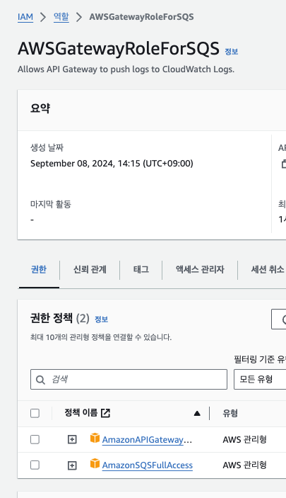

### API Gateway + SQS 연동하기
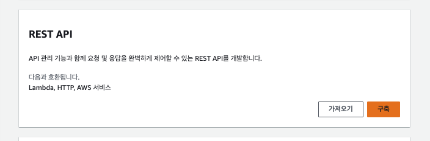
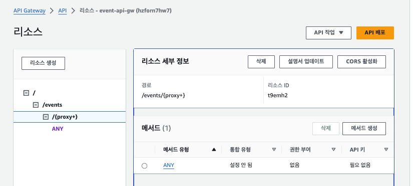
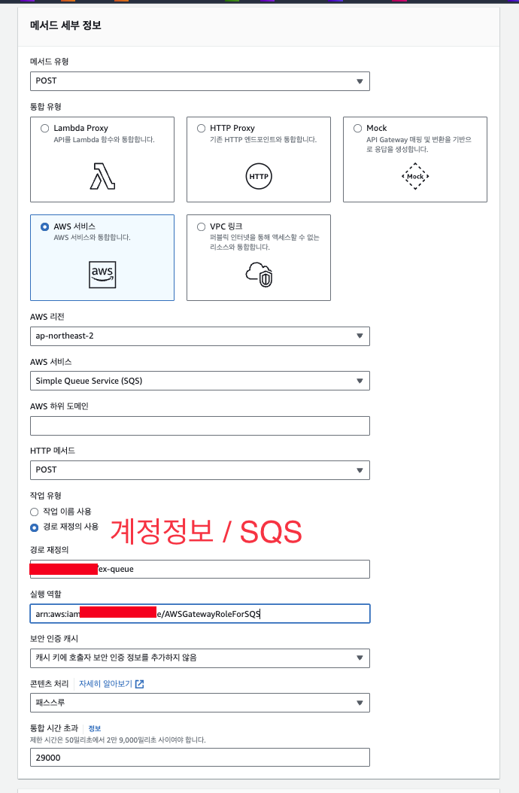
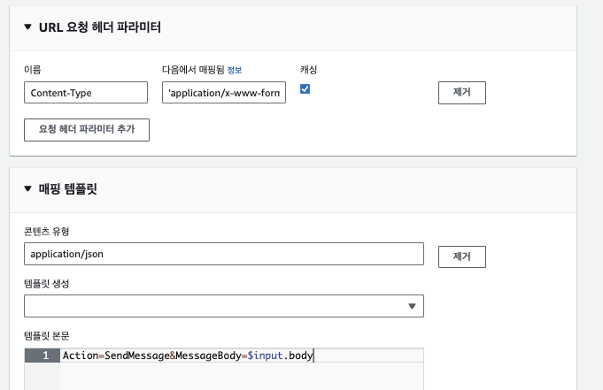
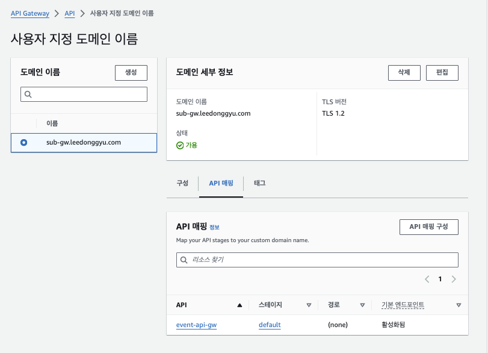
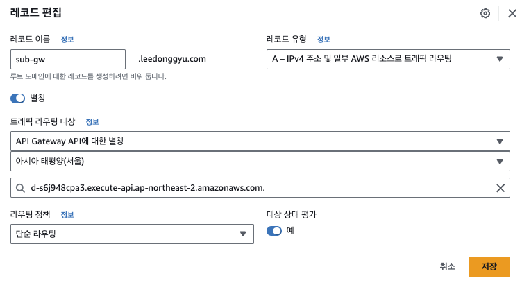

### API Gateway 사용자 지정 도메인

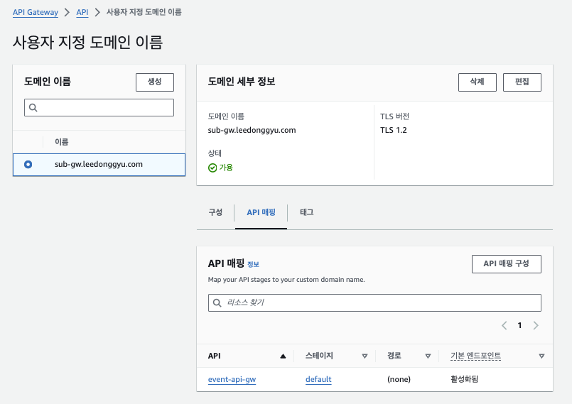

- API Mapping 에서 Stage 별로 따로 Domain 구성해야 함

### EventBridge Pipe 설정

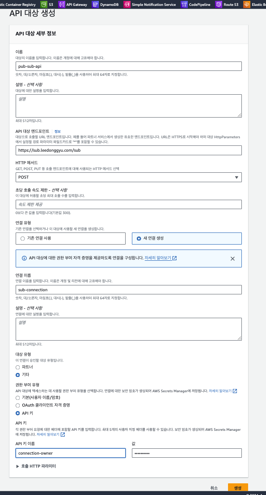
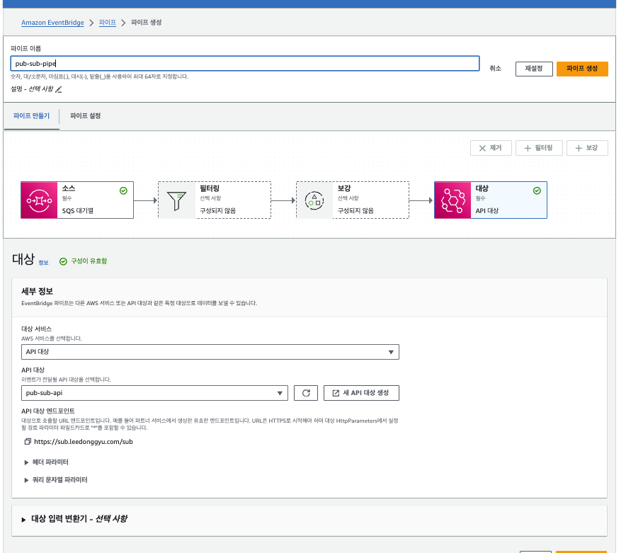

### Result
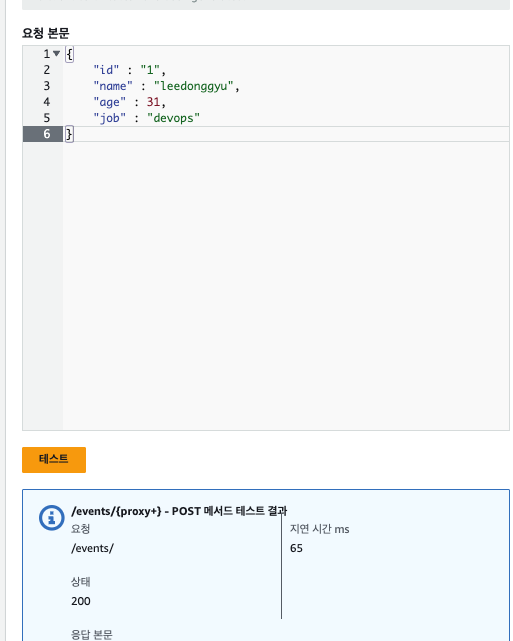

## Reference

- <a href="https://docs.aws.amazon.com/prescriptive-guidance/latest/patterns/integrate-amazon-api-gateway-with-amazon-sqs-to-handle-asynchronous-rest-apis.html"> API Gateway + SQS </a>

- <a href="https://docs.aws.amazon.com/ko_kr/eventbridge/latest/userguide/eb-pipes-input-transformation.html"> Event Bridge Pipe 변환 </a>


```sh
    curl -X POST https://sub-gw.leedonggyu.com/events/sub \
    -H "Content-Type: application/json" \
    -d '{"id": 10, "age" : 31, "name": "leedonggyu", "job": "devops"}'
```

## ...

- <b> Thanks to my "K" </b>